<div align="center">

# 🇪🇺 Universal Sales Agent

### An AI customer-support agent that a European privacy officer can actually sign off on

[](https://github.com/ejazfahil/Universal_Sales_Agent_Multi_Tenant/actions/workflows/ci.yml)


**Personal data never leaves Europe. Nothing that moves money happens without a human.
Every decision is written to a log the database itself refuses to edit.**

</div>

---

<div align="center">

| 209 | 4 | 10 | 0 |
|:---:|:---:|:---:|:---:|
| **tests passing** | **guarantees enforced<br/>by the database** | **EU languages<br/>supported** | **raw identifiers<br/>leaving the EEA** |

</div>

---

## Contents

| | | |
|---|---|---|
| [What this is, in plain English](#-what-this-is-in-plain-english) | [Data model](#-data-model) | [Technology](#-technology) |
| [Why now — the compliance clock](#-why-now--the-compliance-clock) | [How confidence works](#-how-confidence-is-calculated) | [Cost model](#-cost-model) |
| [The core idea](#-the-core-idea-in-one-picture) | [The trust ladder](#-the-trust-ladder--how-autonomy-is-earned) | [Where this sits in the market](#-where-this-sits-in-the-market) |
| [Message flow](#-how-a-single-message-flows) | [Deployment](#-deployment-topology) | [Quick start](#-quick-start) |
| [The four guarantees](#-the-four-guarantees) | [Verification](#-verification--what-is-actually-proven) | [API reference](#-api) |
| [Tenant isolation](#-tenant-isolation-visualised) | [Bugs the tests caught](#three-bugs-the-tests-caught-that-a-demo-never-would) | [Roadmap](#-roadmap) |
| [The operator console](#-what-the-operator-actually-sees) | [System architecture](#-system-architecture) | [Honest limitations](#-honest-limitations) |

---

## 📖 What this is, in plain English

Imagine you run an online skincare brand in Amsterdam. You sell to customers in Germany, France, Italy and the Netherlands. Five thousand support emails a month: *where is my order*, *this arrived broken*, *can I swap the size*.

You want an AI to handle them. Every vendor will sell you one. But then your lawyer asks three questions, and none of the vendors have a good answer:

> **"Where does our customers' personal data actually get processed?"**
> **"What happens if the AI refunds €5,000 to the wrong person at 3am?"**
> **"When the regulator asks what the AI decided and why, what do we show them?"**

This project is an answer to those three questions, built as working software.

<table>
<tr><th width="30%">The lawyer's question</th><th width="33%">The usual answer</th><th width="37%">What this does instead</th></tr>
<tr>
<td><b>Where is our data processed?</b></td>
<td>"We have a contract with a US company that says they'll be careful."</td>
<td>Real names, emails and order numbers are <b>swapped for meaningless codes</b> before the AI ever sees them. The AI reads <code>&lt;CUSTOMER_7f3a&gt;</code>, never "Maya Chen". The decoder book stays on a server in Frankfurt.</td>
</tr>
<tr>
<td><b>What if it refunds €5,000 by mistake?</b></td>
<td>"Our AI is 94% accurate, and you can set limits in the settings."</td>
<td><b>It cannot.</b> The database physically rejects a refund record that has no human approval attached. Not a setting — a constraint.</td>
</tr>
<tr>
<td><b>What do we show the regulator?</b></td>
<td>A CSV export, if someone remembered to log it.</td>
<td>Every decision is written to a log that <b>cannot be edited or deleted by anyone</b>, including a database administrator.</td>
</tr>
</table>

---

## ⏰ Why now — the compliance clock

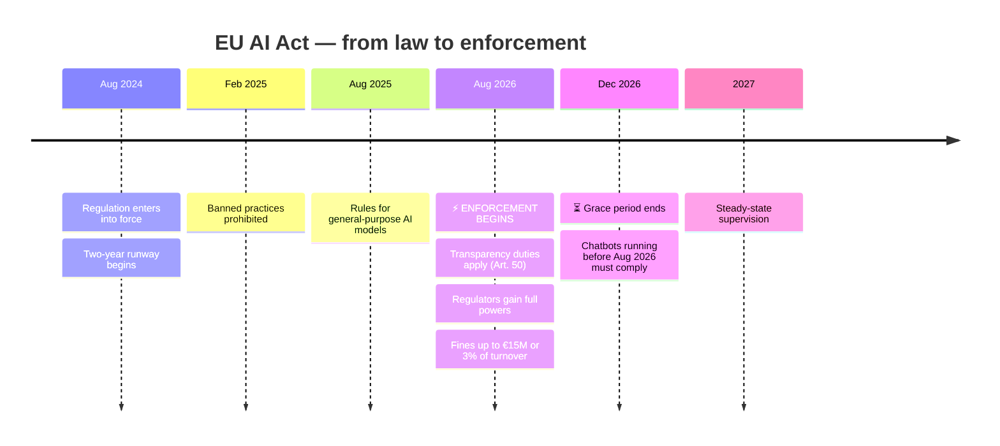

Enforcement began on **2 August 2026**. Every AI chatbot serving European customers must now tell people they're talking to a machine. Businesses that had one running before August have until **2 December 2026**.

Most AI support tools were built in America for American companies. They're now scrambling to answer European questions. This one starts from those questions.

---

## 🔑 The core idea, in one picture

The single hardest constraint: **you cannot run a frontier AI model inside Europe.** Anthropic, OpenAI and Google all process in the US. I verified this rather than assumed it — Anthropic's data-residency setting accepts only `us` or `global`. There is no EU option.

So instead of pretending otherwise, this system makes the data meaningless before it travels:

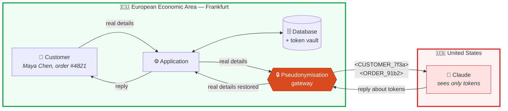

The AI still does its job perfectly. It can reason about "the customer" because the same person always gets the same code within a conversation. But the code is worthless without the decoder book — and the decoder book never leaves Frankfurt.

> **The important part:** the check runs on the *actual bytes about to be sent*, not on a tidy object beforehand. Personal data hides in nested fields, in retrieved documents, in prompts assembled elsewhere. The only question worth asking is whether the request leaving the building is clean — so that is exactly what gets inspected, and if it isn't, the request fails rather than proceeding.

---

## 🔄 How a single message flows

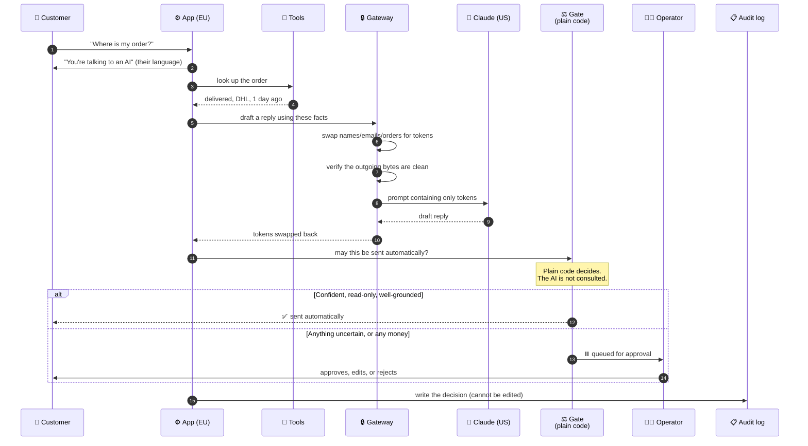

> **Read step 12 twice.** After the AI produces its answer, ordinary code — not the AI — decides whether that answer is allowed out. This is the whole safety argument. You can talk a language model into anything given enough attempts; you cannot talk an `if` statement into anything.

---

## 🛡️ The four guarantees

| # | Guarantee | How it's enforced | Could a competitor copy it? |
|:-:|---|---|---|
| 1 | **Personal data never leaves the EEA** | Tokenised before egress, verified on the serialized request body | Not without re-architecting — a contract amendment can't do it |
| 2 | **No money moves without a human** | A database `CHECK` constraint rejects the row | Easy to copy, rarely done |
| 3 | **The audit log cannot be rewritten** | Permissions revoked *and* a trigger that blocks even an administrator | Easy to copy, almost never done |
| 4 | **No emotion detection, deliberately** | Automated check fails the build if it appears in code | Hard — competitors already shipped it |

### Why guarantee 4 is a feature, not a gap

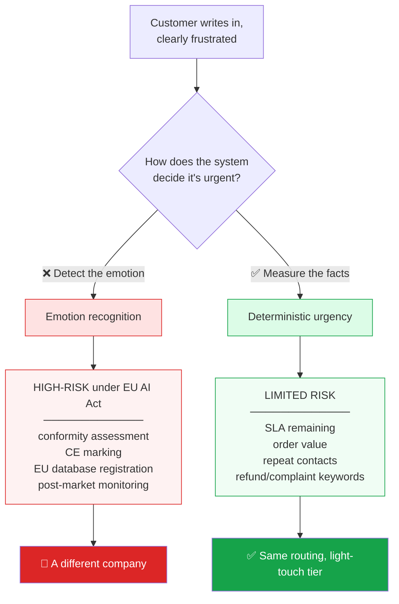

Most AI support tools detect whether a customer sounds angry. It demos well. Since August 2026 it is also, under EU law, a **high-risk AI system**. This system reaches the same routing decision from facts instead — and a competitor who already ships sentiment analysis cannot simply remove it, because for them that's a feature regression.

---

## 🔐 Tenant isolation, visualised

Every brand on the platform is a tenant. The boundary is enforced by PostgreSQL itself, not by application code remembering to filter:

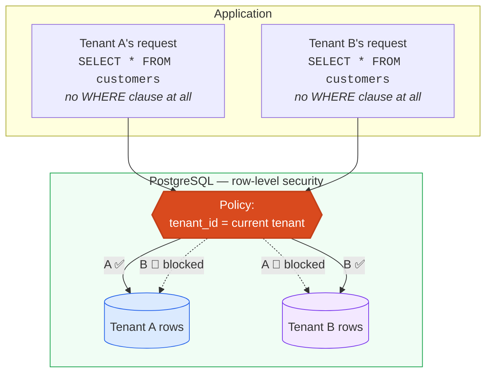

**The test deliberately removes the tenant filter and asserts zero rows come back.** If isolation depended on application code remembering a `WHERE` clause, that query would return everything.

> ⚠️ **A trap worth knowing about.** These policies are *completely bypassed* by a database superuser — and `FORCE ROW LEVEL SECURITY` does not change that; it only binds the table owner. My first CI run against real Postgres showed isolation doing nothing at all for exactly this reason. Migration `0003` adds a restricted role, and the test now asserts `is_superuser = off` **before** making any claim.

---

## 🖥️ What the operator actually sees

```
┌──────────────────────────────────┬───────────────────────────────────┐
│  Conversation                    │  Why this needs review            │
│  ─────────────────────────────   │  ──────────────────────────────   │
│  ℹ You're chatting with an AI…   │  Retrieval     ████████████  99%  │
│                                  │  Grounding  ←  ░░░░░░░░░░░░   0%  │
│  Customer:                       │  Policy match  ███████████░  96%  │
│  "My order hasn't arrived and    │  Familiarity   ████████████  98%  │
│   I need it before Friday."      │                                   │
│                                  │  ⚠ Weakest signal: Grounding.     │
│  AI draft — awaiting approval:   │  The score is the LOWEST of the   │
│  "Your order arrives Tuesday."   │  four, not an average — one weak  │
│                                  │  signal can't hide behind three   │
│  Gate: require approval —        │  strong ones.                     │
│  claims not traceable to tool    │                                   │
│  results. Code decided this,     │  Reasoning trace                  │
│  not the model.                  │  ──────────────────────────────   │
│                                  │  TOOL  commerce.lookup_order      │
│  [Approve & send A] [Edit E]     │        → delivered, DHL, 1d ago   │
│  [Deny D]                        │  RECOMMENDATION  (confidence 0.0) │
└──────────────────────────────────┴───────────────────────────────────┘
```

Notice what's *not* there: a big green "94% confident" badge next to a pre-filled Approve button. That design manufactures the exact complacency the EU AI Act asks operators to guard against. Instead the interface names the **weakest** signal and explains why the number is a minimum rather than an average.

In this example the AI claimed a delivery date no tool result supports. The score is 0%, and it is blocked. **A confident-sounding answer with nothing behind it is the failure mode that matters** — and it is the one the display is built to expose.

*The console is live at `/` when the server is running.*

---

## 🏗️ System architecture

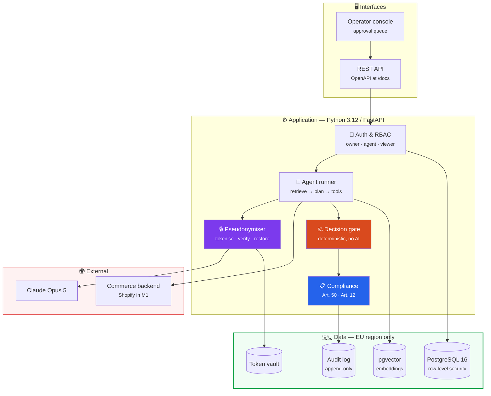

---

## 🗄️ Data model

Every business table carries `tenant_id` and is covered by a row-level security policy.

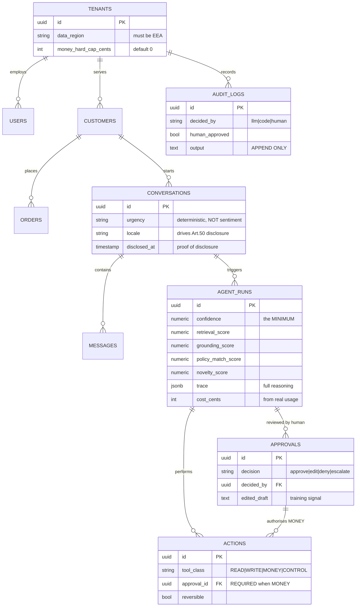

Two invariants live in the schema rather than in application code, because **a constraint the database refuses to violate is worth more than a code path someone can forget**:

```sql
-- No refund record can exist without a human approval attached.
CHECK (tool_class <> 'MONEY' OR approval_id IS NOT NULL)

-- Urgency is a fixed vocabulary. There is deliberately no sentiment column.
CHECK (urgency IN ('low', 'normal', 'high', 'urgent'))
```

---

## 📊 How confidence is calculated

Four independent signals, combined by taking the **lowest** — never the average.

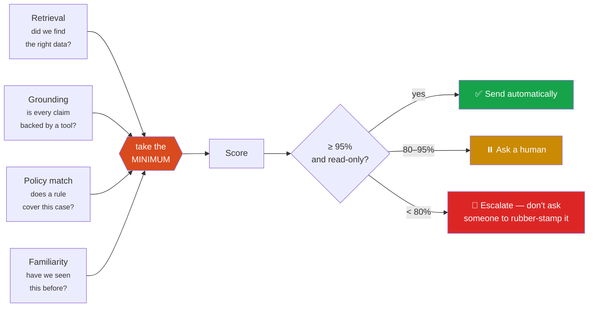

**Why a minimum and not an average?** An average lets three comfortable numbers drown out one alarming one — precisely the case where a person should look. A minimum gives any single signal a veto.

<div align="center">

| Signals | Average would say | Minimum says | Correct? |
|---|:---:|:---:|:---:|
| 0.99, 0.99, 0.98, 0.99 | 0.99 ✅ | 0.98 ✅ | both fine |
| 0.99, **0.10**, 0.99, 0.99 | **0.77** — looks acceptable | **0.10** — blocked | ✅ minimum |

</div>

The second row is a reply that sounds authoritative but is supported by nothing. That is the failure mode that actually costs money.

---

## 🪜 The trust ladder — how autonomy is earned

Autonomy is never configured. It is earned through a track record, and lost instantly:

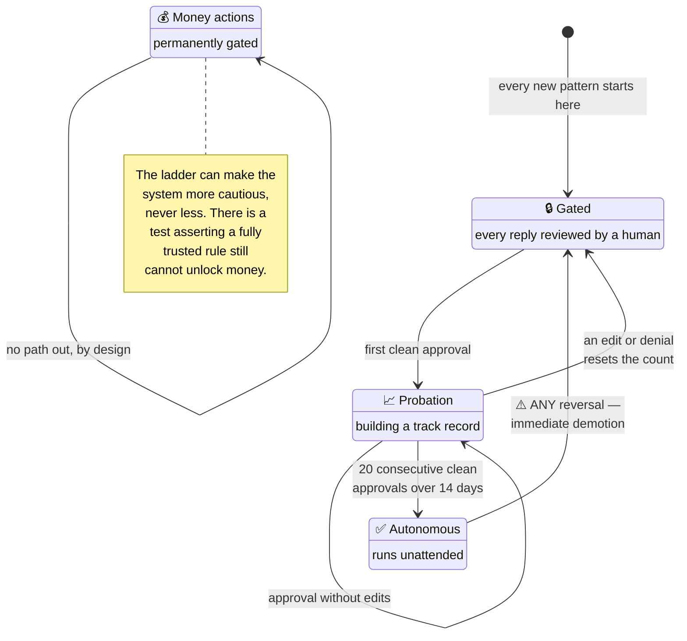

This is EU AI Act Art. 14(4) *"stop the system"* made concrete: one reversal revokes trust immediately, without a deployment or a config change.

---

## 🚀 Deployment topology

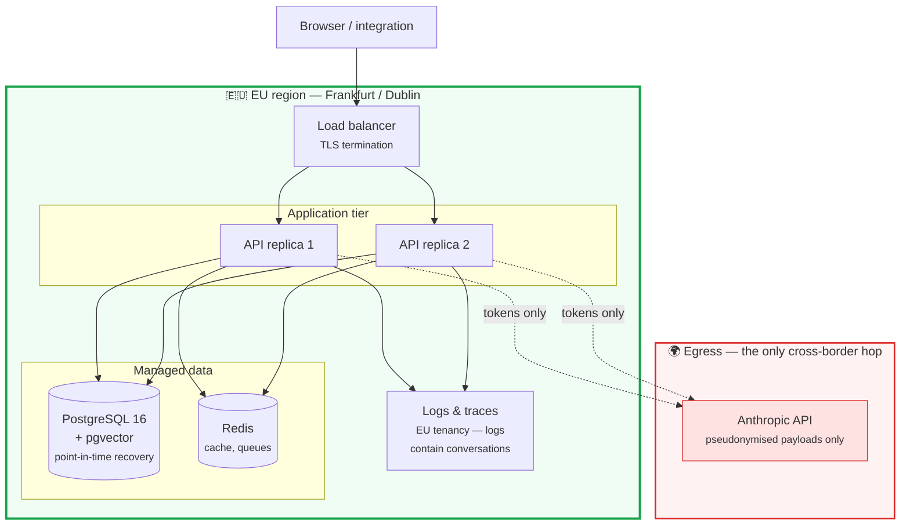

**No US-region log sink.** Logs contain conversation content, so shipping them to a US observability vendor would undo the entire guarantee. The single dotted line is the only traffic that crosses the border, and it carries tokens.

The application refuses to start in `staging` or `production` outside an EEA region — a misconfigured deploy fails loudly at boot rather than quietly processing European personal data elsewhere.

---

## ✅ Verification — what is actually proven

Nothing below is aspirational. Each row is a test that runs on every push.

| What's claimed | How it's proven | Where |
|---|---|---|
| Tenant A can never read tenant B's data | Query with the tenant filter **deliberately removed** returns zero rows | `test_tenant_isolation.py` |
| …and the test isn't cheating | Asserts it is *not* running as a database superuser first | same file |
| Money needs approval | Database rejects the insert; error asserted by name | `test_money_constraint.py` |
| Audit log can't be edited | Even a **superuser's** `UPDATE` raises | `test_audit_append_only.py` |
| No personal data leaves the EEA | 50 messages across EU languages, checked **after serialization** | `test_pseudonymisation.py` |
| …and the check really works | A planted leak is caught | same file |
| Prompt injection can't unlock money | 30 adversarial messages | `test_injection.py` |
| Every conversation discloses the AI | All 10 languages | `test_api.py` |
| A read-only role can't approve | Returns 403 | `test_api.py` |
| No emotion detection anywhere | Build fails if it appears in code | `check_no_emotion_inference.py` |

### Where the 209 tests are

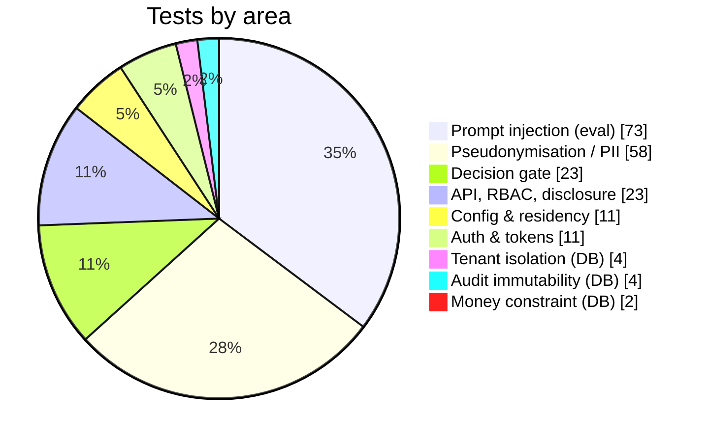

The two largest groups are **adversarial** — injection attempts and PII leak attempts. That distribution is deliberate: those are the tests that would let real harm through.

```
209 tests                          ✅ passing
  ├─ 126 unit
  ├─  73 eval (adversarial)
  └─  10 integration (real Postgres, asserted not-skipped in CI)

mypy --strict     ✅ clean, 26 source files
ruff + format     ✅ clean
I6 emotion guard  ✅ clean (3 reviewed exemptions, all negative declarations)
```

<div align="center">

| Code | Lines |
|---|--:|
| Application (`app/`) | 2,148 |
| Tests (`tests/`) | 1,048 |
| Migrations (`alembic/`) | 480 |

</div>

### Three bugs the tests caught that a demo never would

These are the difference between "it works" and "it's verified":

| # | The bug | Why it mattered |
|:-:|---|---|
| 1 | **Row-level security was completely inert.** Policies all correct — and doing nothing, because tests ran as a database superuser, which bypasses them unconditionally. | Had the suite only ever run as a normal user, it would have gone green while the guarantee was untested **in the configuration that ships**. |
| 2 | **An empty tenant identifier crashed instead of failing safely.** `''::uuid` raised rather than returning nothing. | Wrong failure mode: an error invites a catch-and-continue upstream. Returning nothing is silently safe. Now fails closed. |
| 3 | **The privacy check rejected our own tool documentation** — it used `#4821` as an example order number. | A realistic-looking sample is indistinguishable from a real leak. Sample data doesn't belong in a schema. |

---

## 🛠️ Technology

| Layer | Choice | Why |
|---|---|---|
| Language | **Python 3.12+** | Ecosystem for AI, retrieval and evaluation |
| API | **FastAPI + Pydantic v2** | Validation at the edge; OpenAPI for free |
| Database | **PostgreSQL 16 + pgvector** | Row-level security *is* the isolation mechanism |
| Migrations | **Alembic** | Reversibility tested in CI (`up → down → up`) |
| AI | **Claude Opus 5** | Adaptive thinking; behind an adapter, never called directly |
| Quality | **mypy --strict, ruff, pytest** | Strict typing is not optional in money-touching code |
| Deploy | **Docker, GitHub Actions** | EU regions only |

---

## 💶 Cost model

Real token usage is recorded per conversation — never estimated from text length, which is how a "cost per resolution" figure becomes fiction.

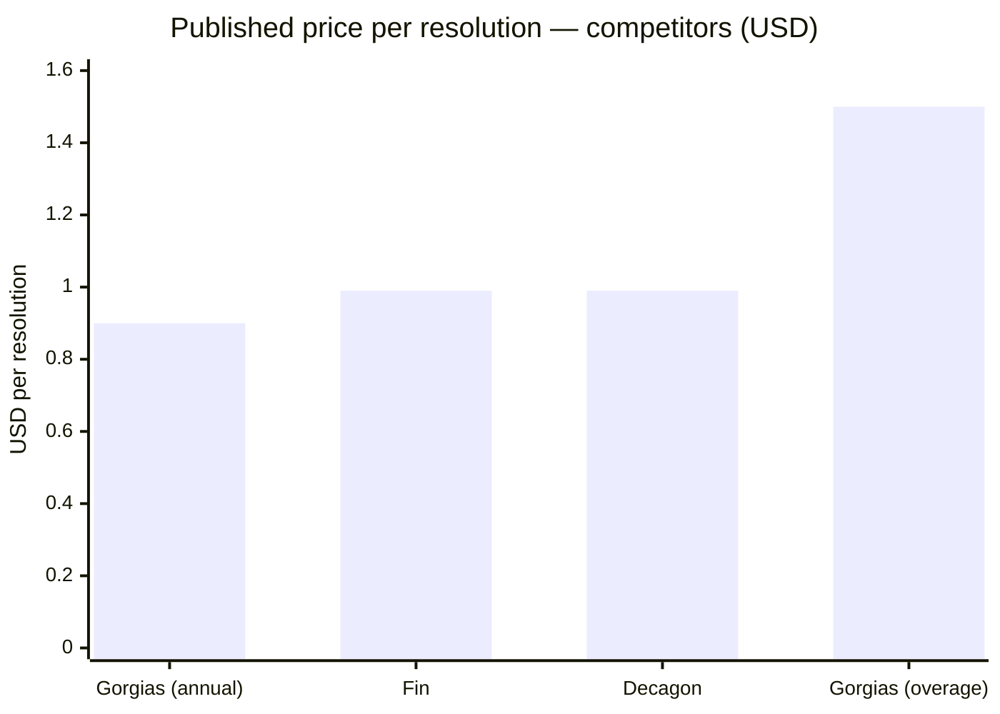

| Model | Input / 1M tokens | Output / 1M tokens | Used for |
|---|--:|--:|---|
| Claude Opus 5 | $5.00 | $25.00 | The agent, the gate, anything touching money |
| Claude Sonnet 5 | $2.00 | $10.00 | Routine drafting |
| Claude Haiku 4.5 | $1.00 | $5.00 | Classification, high volume |

Competitors cluster at **$0.90–$1.00 per resolution**, with overage at $1.50. Recording true cost per conversation — tokens in, tokens out, priced at list — is what makes it possible to compete on that number honestly rather than asserting it.

---

## 🎯 Where this sits in the market

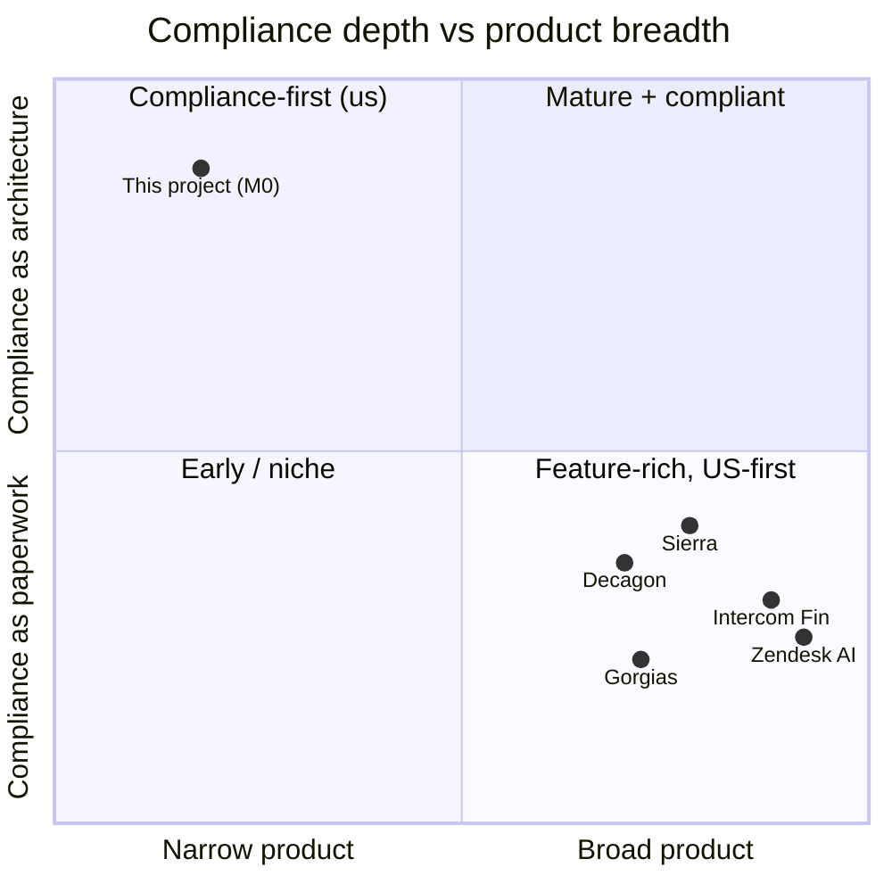

An honest placement. This project is **narrow** — one workflow, read-only — and deliberately deep on compliance. The incumbents are the reverse. The bet is that a December deadline makes the vertical axis matter more than it did in 2025, and that moving up it requires re-architecture rather than a contract amendment.

---

## ⚡ Quick start

```bash
git clone https://github.com/ejazfahil/Universal_Sales_Agent_Multi_Tenant.git
cd Universal_Sales_Agent_Multi_Tenant

uv sync --all-groups          # install (uv is a fast Python package manager)
uv run pytest -q              # 199 tests — no database, no API key needed
uv run uvicorn app.main:app --reload
```

| URL | What you get |
|---|---|
| `http://localhost:8000/` | The operator console |
| `http://localhost:8000/docs` | Interactive API reference |
| `http://localhost:8000/health` | Liveness **and** which region it's running in |

> **No API key required.** The system ships a deterministic stand-in for the AI, so the whole pipeline runs offline. Add `ANTHROPIC_API_KEY` and swap one line to use the real model.

With a database, which adds the isolation and immutability tests:

```bash
docker compose up -d
uv run alembic upgrade head
uv run pytest -q              # now 209
```

---

## 🌐 API

| Method | Endpoint | Purpose | Role |
|---|---|---|:-:|
| `GET` | `/health` | Liveness + data-residency posture | — |
| `POST` | `/chat` | One conversation turn | read |
| `GET` | `/chat/policy` | What the AI is permitted to do here | read |
| `POST` | `/approvals` | Approve, edit, deny, or escalate | approve |
| `POST` | `/approvals/bulk` | Grouped decisions, recorded individually | approve |
| `GET` | `/gdpr/erasure-scope` | What deletion actually reaches | read |

<details>
<summary><b>Example: a chat turn and its response</b></summary>

```bash
curl -X POST localhost:8000/chat \
  -H "Authorization: Bearer $TOKEN" -H "Content-Type: application/json" \
  -d '{"message":"Where is my order?","customer_ref":"c1","locale":"de",
       "customer_name":"Maya Chen","order_refs":["#4821"]}'
```

```jsonc
{
  "disclosure": "Sie chatten mit einem KI-Assistenten…",  // their language
  "decision": "require_approval",
  "reason": "claims not traceable to tool results",       // why, in words
  "delivered": false,                                     // held back
  "confidence": 0.0,
  "weakest_signal": "grounding",                          // which signal, named
  "confidence_components": { "retrieval_score": 0.4, "grounding_score": 0.0 },
  "trace": [ { "kind": "TOOL", "tool": "commerce.lookup_order", "result": "…" } ],
  "cost_cents": 0,
  "latency_ms": 1
}
```

The response explains itself. An operator, an auditor and a developer can all read the same payload and understand what happened.
</details>

### Roles

| Role | Read | Approve | Configure | Export |
|---|:-:|:-:|:-:|:-:|
| **owner** | ✅ | ✅ | ✅ | ✅ |
| **agent** | ✅ | ✅ | — | — |
| **viewer** | ✅ | — | — | — |

Permissions are an explicit set per role rather than a ranking, so *"a viewer cannot approve"* is a stated fact rather than something inferred from an ordering.

---

## 📁 Project layout

```
app/
├── privacy/      🔒 tokenise, verify, restore — the EEA boundary
│   ├── gateway.py      the verification that runs on outgoing bytes
│   ├── detectors.py    emails, phones, IBANs, cards, addresses, names
│   └── vault.py        token ↔ value mapping, stays in region
├── agent/        🤖 the loop
│   ├── runner.py       retrieve → plan → tools → gate
│   ├── gate.py         ⚖️ the deterministic decision — read this one first
│   ├── confidence.py   four signals, combined by minimum
│   ├── tools.py        catalogue + risk classification
│   └── llm.py          adapter; the app never imports the SDK
├── compliance/   📋 disclosure.py (Art. 50) · audit.py (Art. 12)
├── db/           🗄️ tenant-scoped models, row-level security
├── api/          🌐 chat · approvals · gdpr · health
└── static/       🖥️ operator console

alembic/versions/
├── 0001  schema
├── 0002  row-level security
├── 0003  restricted role  ← without this, 0002 does nothing
└── 0004  append-only audit log
```

> **Reading this codebase?** Start at [`app/agent/gate.py`](app/agent/gate.py). It's ~120 lines, has no dependency on the AI, and is the entire answer to *"what is this thing allowed to do"*.

---

## 🗺️ Roadmap

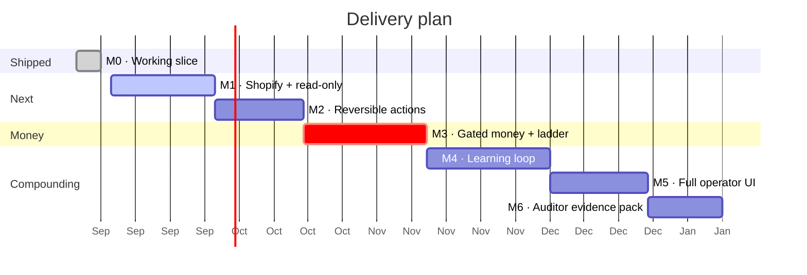

| | Milestone | What it adds |
|:-:|---|---|
| ✅ | **M0** | Isolation, privacy gateway, gate, approvals, audit, console |
| ⬜ | **M1** | Shopify integration; product Q&A, inventory, compatibility |
| ⬜ | **M2** | Address changes, subscription pauses — reversible, gated |
| ⬜ | **M3** | Returns and refunds; the trust ladder goes live |
| ⬜ | **M4** | Corrections cluster into reviewed guidelines |
| ⬜ | **M5** | Full operator interface |
| ⬜ | **M6** | One-command audit bundle for any date range |

---

## ⚖️ Honest limitations

A project that only lists strengths isn't an engineering document.

- **This is M0.** One workflow (order status), read-only, with a fixture commerce backend behind a real interface. The architecture is proven end to end; the product surface is small.
- **The AI adapter defaults to a deterministic stand-in.** Deliberate — the pipeline is fully testable offline — but the real model has not been run at volume here.
- **Name detection leans on a roster** of values already in our database rather than general-purpose entity recognition. Robust for the common case; I'd add a proper NER model before claiming coverage of arbitrary free text.
- **No identity graph, and I wouldn't build one.** Competitors have a decade of that infrastructure. Integrating with Shopify Customer Accounts is the right call.
- **The compliance advantage has a shelf life.** Competitors will stand up EU regions eventually. Realistically 12–18 months, after which the learning loop has to hold the account.
- **The core support agent is commodity.** Roughly 70% of this is table stakes. The defensible part is the compliance substrate — and I'd rather say that plainly than oversell it.

---

## 📚 Documentation

| Document | What's in it |
|---|---|
| [`BUILD_PROMPT.md`](BUILD_PROMPT.md) | The execution spec: invariants, tickets, acceptance criteria |
| [`CLAUDE.md`](CLAUDE.md) | Operating rules for AI coding agents |
| [`PROGRESS.md`](PROGRESS.md) | Build ledger — every decision, and why |
| [`docs/01-master-plan.md`](docs/01-master-plan.md) | Product and UI specification |
| [`docs/02-eu-platform-plan.md`](docs/02-eu-platform-plan.md) | EU architecture, GDPR checklist, AI Act analysis |
| [`docs/03-market-and-positioning.md`](docs/03-market-and-positioning.md) | Market, customers, competitors, honest assessment |
| [`docs/reference/`](docs/reference/) | AI Act obligations mapped to the code implementing them |

---

<div align="center">

**MIT licensed** · Built with [Claude Code](https://claude.com/claude-code)

*Regulatory summaries here are engineering notes, not legal advice.*

</div>
