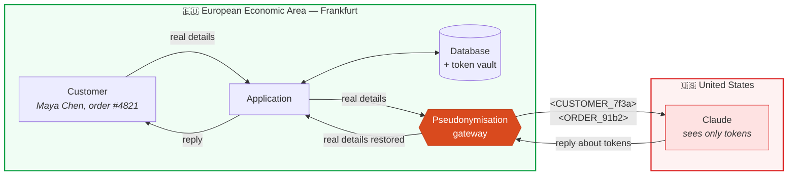
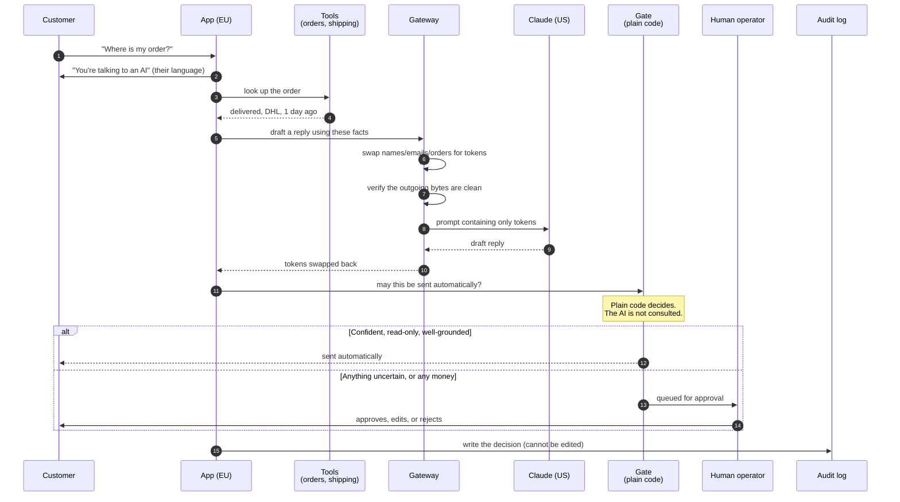
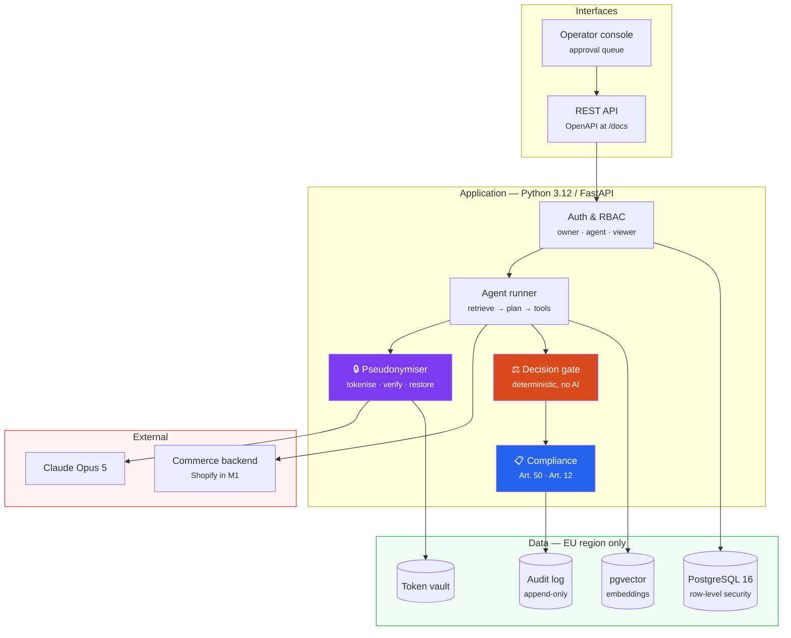
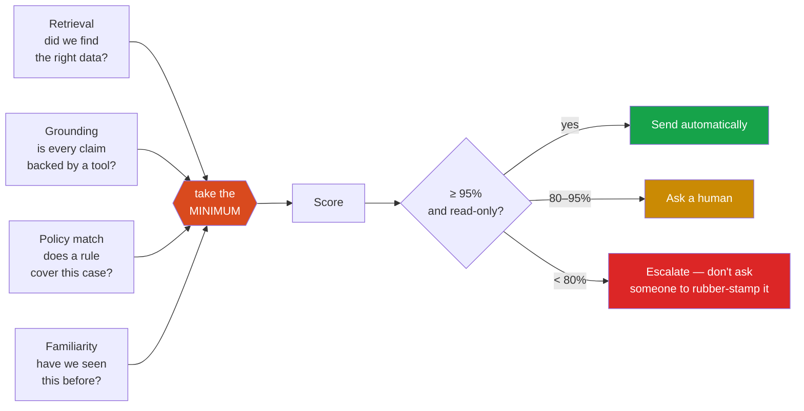

<div align="center">

# Universal Sales Agent

### An AI customer-support agent that a European privacy officer can actually sign off on

[](https://github.com/ejazfahil/Universal_Sales_Agent_Multi_Tenant/actions/workflows/ci.yml)


**Personal data never leaves Europe. Nothing that moves money happens without a human. Every decision is written to a log the database itself refuses to edit.**

</div>

---

## Start here — what this is, in plain English

Imagine you run an online skincare brand in Amsterdam. You sell to customers in Germany, France, Italy and the Netherlands. Five thousand support emails a month: *where is my order*, *this arrived broken*, *can I swap the size*.

You want an AI to handle them. Every vendor will sell you one. But then your lawyer asks three questions, and none of the vendors have a good answer:

> **"Where does our customers' personal data actually get processed?"**
> **"What happens if the AI refunds €5,000 to the wrong person at 3am?"**
> **"When the regulator asks what the AI decided and why, what do we show them?"**

This project is an answer to those three questions, built as working software.

<table>
<tr><th width="33%">The lawyer's question</th><th width="33%">The usual answer</th><th width="33%">What this does instead</th></tr>
<tr>
<td><b>Where is our data processed?</b></td>
<td>"We have a contract with a US company that says they'll be careful."</td>
<td>Real names, emails and order numbers are <b>swapped for meaningless codes</b> before the AI ever sees them. The AI reads <code>&lt;CUSTOMER_7f3a&gt;</code>, never "Maya Chen". The decoder book stays on a server in Frankfurt.</td>
</tr>
<tr>
<td><b>What if it refunds €5,000 by mistake?</b></td>
<td>"Our AI is 94% accurate, and you can set limits in the settings."</td>
<td><b>It cannot.</b> The database physically rejects a refund record that has no human approval attached. Not a setting — a constraint.</td>
</tr>
<tr>
<td><b>What do we show the regulator?</b></td>
<td>A CSV export, if someone remembered to log it.</td>
<td>Every decision is written to a log that <b>cannot be edited or deleted by anyone</b>, including a database administrator.</td>
</tr>
</table>

### Why this matters right now

On **2 August 2026** the EU AI Act became enforceable. Every AI chatbot serving European customers must now tell people they're talking to a machine. Fines reach **€15 million or 3% of worldwide turnover**. Businesses that had a chatbot running before August have until **2 December 2026** to comply.

Most AI support tools were built in America for American companies. They're now scrambling to answer European questions. This one starts from those questions.

---

## The core idea, in one picture

The single hardest constraint: **you cannot run a frontier AI model inside Europe.** Anthropic, OpenAI and Google all process in the US. I verified this rather than assumed it — Anthropic's data-residency setting accepts only `us` or `global`. There is no EU option.

So instead of pretending otherwise, this system makes the data meaningless before it travels:



The AI still does its job perfectly. It can reason about "the customer" because the same person always gets the same code within a conversation. But the code is worthless without the decoder book — and the decoder book never leaves Frankfurt.

**The important part:** the check runs on the *actual bytes about to be sent*, not on a tidy object beforehand. Personal data hides in nested fields, in retrieved documents, in prompts assembled elsewhere. The only question worth asking is whether the request leaving the building is clean, so that is exactly what gets inspected — and if it isn't, the request fails rather than proceeding.

---

## How a single message flows through the system



**Read step 12 twice.** After the AI produces its answer, ordinary code — not the AI — decides whether that answer is allowed out. This is the whole safety argument. You can talk a language model into anything given enough attempts; you cannot talk an `if` statement into anything.

---

## The four guarantees

| # | Guarantee | How it's enforced | Could a competitor copy it? |
|:-:|---|---|---|
| 1 | **Personal data never leaves the EEA** | Tokenised before egress, verified on the serialized request body | Not without re-architecting — a contract amendment can't do it |
| 2 | **No money moves without a human** | A database `CHECK` constraint rejects the row | Easy to copy, rarely done |
| 3 | **The audit log cannot be rewritten** | Permissions revoked *and* a database trigger that blocks even an administrator | Easy to copy, almost never done |
| 4 | **No emotion detection, deliberately** | Automated check fails the build if it appears in code | Hard — competitors already shipped it |

### Why guarantee 4 is a feature, not a gap

Most AI support tools detect whether a customer sounds angry. It demos well. Since August 2026 it is also, under EU law, a **high-risk AI system** — which drags the whole product into formal conformity assessment, CE marking and EU database registration.

This system reaches the same routing decision without it. Urgency is calculated from facts: how close the response deadline is, how much the order was worth, how many times this person has already written in, whether the message contains words like "refund" or "complaint". Same behaviour, no inference about anyone's inner state, and the product stays in the light-touch regulatory tier.

A competitor who already ships sentiment analysis cannot simply remove it — for them that's a feature regression.

---

## What the operator actually sees

The person reviewing the AI's work sees this:

```
┌──────────────────────────────────┬───────────────────────────────────┐
│  Conversation                    │  Why this needs review            │
│  ─────────────────────────────   │  ──────────────────────────────   │
│  ℹ You're chatting with an AI…   │  Retrieval     ████████████  99%  │
│                                  │  Grounding  ←  ░░░░░░░░░░░░   0%  │
│  Customer:                       │  Policy match  ███████████░  96%  │
│  "My order hasn't arrived and    │  Familiarity   ████████████  98%  │
│   I need it before Friday."      │                                   │
│                                  │  ⚠ Weakest signal: Grounding.     │
│  AI draft — awaiting approval:   │  The score is the LOWEST of the   │
│  "Your order arrives Tuesday."   │  four, not an average — one weak  │
│                                  │  signal can't hide behind three   │
│  Gate: require approval —        │  strong ones.                     │
│  claims not traceable to tool    │                                   │
│  results. Code decided this,     │  Reasoning trace                  │
│  not the model.                  │  ──────────────────────────────   │
│                                  │  TOOL  commerce.lookup_order      │
│  [Approve & send A] [Edit E]     │        → delivered, DHL, 1d ago   │
│  [Deny D]                        │  RECOMMENDATION  (confidence 0.0) │
└──────────────────────────────────┴───────────────────────────────────┘
```

Notice what's *not* there: a big green "94% confident" badge next to a pre-filled Approve button. That design manufactures the exact complacency the EU AI Act asks operators to guard against. Instead the interface names the **weakest** signal and explains why the number is a minimum rather than an average.

In this example the AI claimed a delivery date no tool result supports. The score is 0%, and it is blocked. **A confident-sounding answer with nothing behind it is the failure mode that matters**, and it is the one the display is built to expose.

Run it yourself: the console is at `/` when the server is running.

---

## System architecture



### How confidence is calculated

Four independent signals, combined by taking the **lowest** — never the average.



An average would let three comfortable numbers drown out one alarming one — which is precisely the case where a person should look. A minimum gives any single signal a veto.

---

## Verification — what is actually proven

Nothing below is aspirational. Each row is a test that runs on every push.

| What's claimed | How it's proven | Where |
|---|---|---|
| Tenant A can never read tenant B's data | Query with the tenant filter **deliberately removed** returns zero rows | `test_tenant_isolation.py` |
| …and the test isn't cheating | Asserts it is *not* running as a database superuser first | same file |
| Money needs approval | Database rejects the insert; error asserted by name | `test_money_constraint.py` |
| Audit log can't be edited | Even a superuser's `UPDATE` raises | `test_audit_append_only.py` |
| No personal data leaves the EEA | 50 messages across EU languages, each checked after serialization | `test_pseudonymisation.py` |
| …and the check really works | A planted leak is caught | same file |
| Prompt injection can't unlock money | 30 adversarial messages | `test_injection.py` |
| Every conversation discloses the AI | All 10 languages | `test_api.py` |
| A read-only role can't approve | Returns 403 | `test_api.py` |
| No emotion detection anywhere | Build fails if it appears in code | `check_no_emotion_inference.py` |

```
199 unit + eval tests             ✅ passing
integration tests (real Postgres) ✅ passing in CI, asserted not-skipped
mypy --strict                     ✅ clean, 26 source files
ruff + format                     ✅ clean
```

### Three bugs the tests caught that a demo never would

Worth reading, because they're the difference between "it works" and "it's verified":

1. **Row-level security was doing nothing at all.** Every policy was written correctly and was completely inert, because the test connected as a database superuser — and superusers bypass those policies unconditionally. Had the suite only ever run as a normal user, it would have passed while the guarantee was untested in the configuration that ships. Fixed by adding a restricted role, plus a test that now *asserts it isn't a superuser* before making any claim.

2. **An empty tenant identifier crashed instead of failing safely.** The wrong failure mode: an error invites someone upstream to catch and continue, whereas returning nothing is silently safe. Now it fails closed.

3. **The privacy check rejected our own tool documentation** — because it used `#4821` as an example order number, which is indistinguishable from a real leak. The example was removed. Realistic-looking sample data doesn't belong in a schema.

---

## Technology

| Layer | Choice | Why |
|---|---|---|
| Language | Python 3.12+ | Ecosystem for AI, retrieval and evaluation |
| API | FastAPI + Pydantic v2 | Validation at the edge; OpenAPI for free |
| Database | PostgreSQL 16 + pgvector | Row-level security is the isolation mechanism |
| Migrations | Alembic | Reversibility tested in CI (`up → down → up`) |
| AI | Claude Opus 5 | Adaptive thinking; behind an adapter, never called directly |
| Quality | mypy --strict, ruff, pytest | Strict typing is not optional in money-touching code |
| Deploy | Docker Compose, GitHub Actions | EU regions only |

### Cost model

Real token usage is recorded per conversation — never estimated from text length, which is how a "cost per resolution" figure becomes fiction.

| Model | Input / 1M tokens | Output / 1M tokens | Used for |
|---|--:|--:|---|
| Claude Opus 5 | $5.00 | $25.00 | The agent, the gate, anything touching money |
| Claude Sonnet 5 | $2.00 | $10.00 | Routine drafting |
| Claude Haiku 4.5 | $1.00 | $5.00 | Classification, high volume |

Competitors charge roughly **$0.90–$1.00 per resolution**. Recording true cost per conversation is what makes it possible to compete on that number honestly.

---

## Quick start

```bash
git clone https://github.com/ejazfahil/Universal_Sales_Agent_Multi_Tenant.git
cd Universal_Sales_Agent_Multi_Tenant

uv sync --all-groups          # install (uv is a fast Python package manager)
uv run pytest -q              # 199 tests, no database or API key needed
uv run uvicorn app.main:app --reload
```

Then open:

| URL | What you get |
|---|---|
| `http://localhost:8000/` | The operator console |
| `http://localhost:8000/docs` | Interactive API reference |
| `http://localhost:8000/health` | Liveness **and** which region it's running in |

**No API key required.** The system ships a deterministic stand-in for the AI, so the full pipeline runs offline. Add `ANTHROPIC_API_KEY` and swap one line to use the real model.

With a database (for the isolation tests):

```bash
docker compose up -d
uv run alembic upgrade head
uv run pytest -q              # now includes integration tests
```

---

## API

| Method | Endpoint | Purpose | Required role |
|---|---|---|:-:|
| `GET` | `/health` | Liveness + data-residency posture | — |
| `POST` | `/chat` | One conversation turn | read |
| `GET` | `/chat/policy` | What the AI is permitted to do here | read |
| `POST` | `/approvals` | Approve, edit, deny, or escalate | approve |
| `POST` | `/approvals/bulk` | Grouped decisions, recorded individually | approve |
| `GET` | `/gdpr/erasure-scope` | What deletion actually reaches | read |

<details>
<summary><b>Example: a chat turn and its response</b></summary>

```bash
curl -X POST localhost:8000/chat \
  -H "Authorization: Bearer $TOKEN" -H "Content-Type: application/json" \
  -d '{"message":"Where is my order?","customer_ref":"c1","locale":"de",
       "customer_name":"Maya Chen","order_refs":["#4821"]}'
```

```jsonc
{
  "disclosure": "Sie chatten mit einem KI-Assistenten…",  // their language
  "decision": "require_approval",
  "reason": "claims not traceable to tool results",       // why, in words
  "delivered": false,                                     // held back
  "confidence": 0.0,
  "weakest_signal": "grounding",                          // which signal, named
  "confidence_components": { "retrieval_score": 0.4, "grounding_score": 0.0 },
  "trace": [ { "kind": "TOOL", "tool": "commerce.lookup_order", "result": "…" } ],
  "cost_cents": 0,
  "latency_ms": 1
}
```

The response explains itself. That is the point: an operator, an auditor and a developer can all read the same payload and understand what happened.
</details>

---

## Roles

| Role | Read | Approve | Configure | Export |
|---|:-:|:-:|:-:|:-:|
| **owner** | ✅ | ✅ | ✅ | ✅ |
| **agent** | ✅ | ✅ | — | — |
| **viewer** | ✅ | — | — | — |

Permissions are an explicit set per role rather than a ranking, so *"a viewer cannot approve"* is a stated fact rather than something inferred from an ordering.

---

## Project layout

```
app/
├── privacy/      🔒 tokenise, verify, restore — the EEA boundary
│   ├── gateway.py      the verification that runs on outgoing bytes
│   ├── detectors.py    emails, phones, IBANs, cards, addresses, names
│   └── vault.py        token ↔ value mapping, stays in region
├── agent/        🤖 the loop
│   ├── runner.py       retrieve → plan → tools → gate
│   ├── gate.py         ⚖️ the deterministic decision — read this one first
│   ├── confidence.py   four signals, combined by minimum
│   ├── tools.py        catalogue + risk classification
│   └── llm.py          adapter; the app never imports the SDK
├── compliance/   📋 disclosure.py (Art. 50) · audit.py (Art. 12)
├── db/           🗄️ tenant-scoped models, row-level security
├── api/          🌐 chat · approvals · gdpr · health
└── static/       🖥️ operator console

alembic/versions/
├── 0001  schema
├── 0002  row-level security
├── 0003  restricted role  ← without this, 0002 does nothing
└── 0004  append-only audit log

docs/
├── 01-master-plan.md            product & UI specification
├── 02-eu-platform-plan.md       EU architecture, GDPR, AI Act analysis
├── 03-market-and-positioning.md market, ICP, competitors, honest assessment
└── reference/                   AI Act obligations mapped to code
```

**Reading this codebase?** Start at [`app/agent/gate.py`](app/agent/gate.py). It's about 120 lines, it has no dependencies on the AI, and it is the entire answer to "what is this thing allowed to do".

---

## Roadmap

| | Milestone | Status |
|:-:|---|---|
| ✅ | **M0** — working slice: isolation, privacy gateway, gate, approvals, audit, console | **Complete** |
| ⬜ | **M1** — Shopify integration; more read-only workflows | Next |
| ⬜ | **M2** — reversible actions: address changes, subscription pauses | |
| ⬜ | **M3** — money, always gated; trust ladder with instant demotion on reversal | |
| ⬜ | **M4** — learning loop: corrections become reviewed guidelines | |
| ⬜ | **M5** — full operator interface | |
| ⬜ | **M6** — auditor evidence pack | |

**The trust ladder (M3)** is how autonomy is earned rather than configured: a pattern must succeed 20 consecutive times over two weeks before it runs unattended, and a single reversal demotes it immediately. Money is excluded permanently — the ladder can make the system more cautious, never less.

---

## Honest limitations

A project that only lists strengths isn't an engineering document.

- **This is M0.** One workflow (order status), read-only, with a fixture commerce backend behind a real interface. The architecture is proven end to end; the product surface is small.
- **The AI adapter defaults to a deterministic stand-in.** Deliberate — the pipeline is fully testable offline — but the real model has not been run at volume here.
- **Name detection leans on a roster** of values already in our database rather than general-purpose entity recognition. Robust for the common case, and I'd add a proper NER model before claiming coverage of arbitrary free text.
- **No identity graph, and I wouldn't build one.** Competitors have a decade of that infrastructure. Integrating with Shopify Customer Accounts is the right call.
- **The compliance advantage has a shelf life.** Competitors will stand up EU regions eventually. Realistically 12–18 months, after which the learning loop has to hold the account.
- **The core support agent is commodity.** Roughly 70% of this is table stakes. The defensible part is the compliance substrate — and I'd rather say that plainly than oversell it.

---

## Documentation

| Document | What's in it |
|---|---|
| [`BUILD_PROMPT.md`](BUILD_PROMPT.md) | The execution spec: invariants, tickets, acceptance criteria |
| [`CLAUDE.md`](CLAUDE.md) | Operating rules for AI coding agents |
| [`PROGRESS.md`](PROGRESS.md) | Build ledger, including every decision and why |
| [`docs/01-master-plan.md`](docs/01-master-plan.md) | Product and UI specification |
| [`docs/02-eu-platform-plan.md`](docs/02-eu-platform-plan.md) | EU architecture, GDPR checklist, AI Act analysis |
| [`docs/03-market-and-positioning.md`](docs/03-market-and-positioning.md) | Market, customers, competitors, honest assessment |
| [`docs/reference/`](docs/reference/) | AI Act obligations mapped to the code implementing them |

---

<div align="center">

**MIT licensed.** Built with [Claude Code](https://claude.com/claude-code).

*Regulatory summaries here are engineering notes, not legal advice.*

</div>
